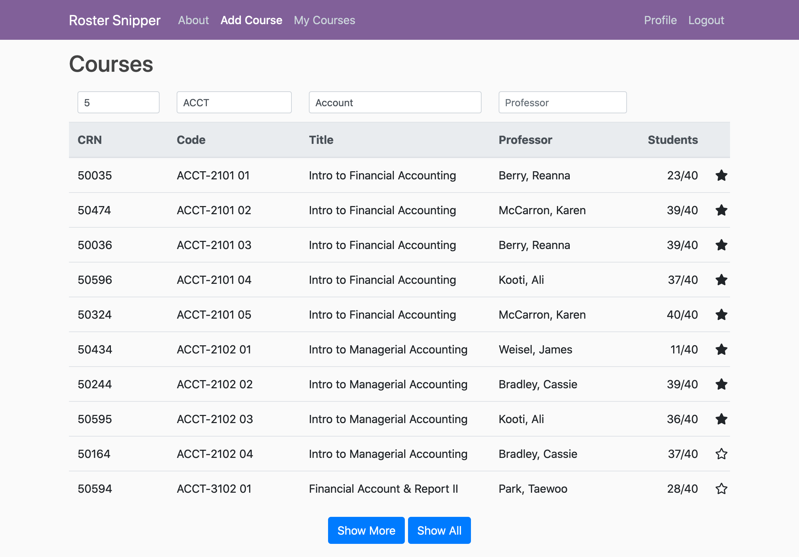
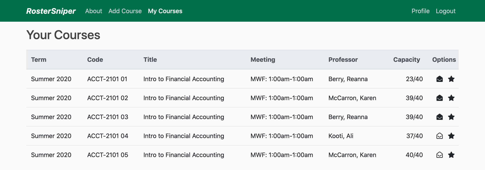

# 

RosterSniper is a web application used for monitoring course availability at Georgia Gwinnett College.

- **Website:** http://rsniper.shitchell.com
- **Source Code:** https://github.com/soft-eng-practicum/ggc-coursicle
- **Bug Reports:** https://github.com/soft-eng-practicum/ggc-coursicle/issues

## About

The website is built using Django, jQuery and plugins, Font Awesome, et al.

Here is the Add Course page:

and here is the My Courses page:

## Installation

The project requires Python 3.8 or higher and Django 3, along with a few others packages as described in [requirements.txt](requirements.txt). It is recommend that you create a virtual environment with these packages. The website uses jQuery, Popper.js, Bootstrap, and Font Awesome but they are not hosted locally, instead they are hot-linked from a few CDNs. However the tablesorter jQuery plugin is hosted locally and [included](roster_sniper/core/static/tablesorter) in this repository.

The development web server is ran using the command `python manage.py runserver`.

Our developer documentation can be found [here](roster_sniper/notes).

## Our Team

**Shaun Mitchell:** smitchell11@ggc.edu
1. Co-CEO
2. Code architecture/lead programmer
3. Data modeler
4. Team manager
5. Client liaison

**Ryan Cosentino:** rcosentino@ggc.edu
1. Co-CEO
2. UI/UX design
3. Documentation lead
4. Testing lead
