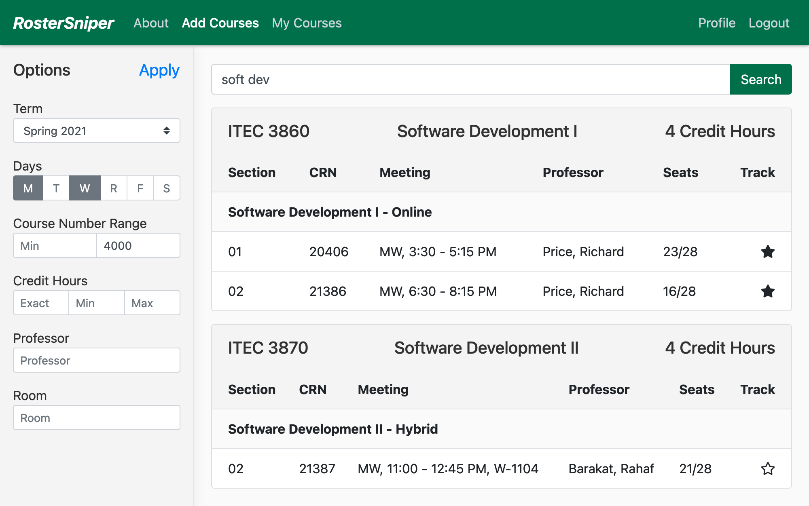
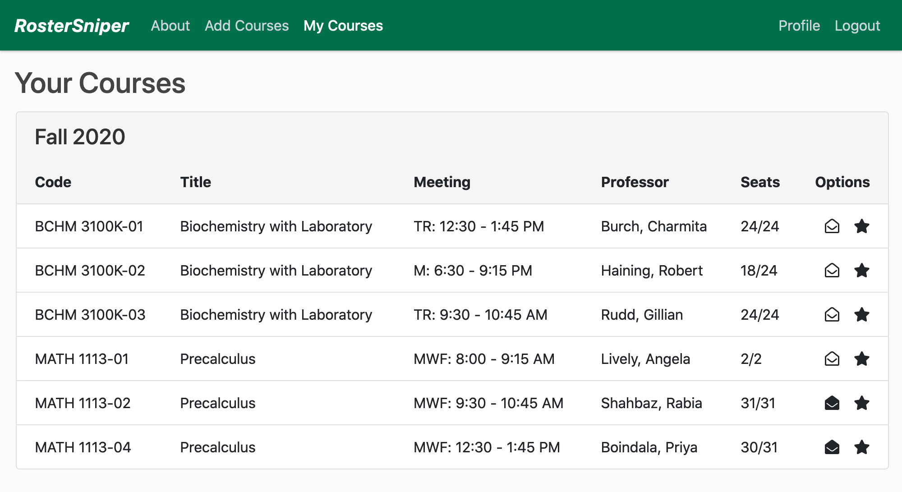

# 

RosterSniper is a web application used for monitoring course availability at Georgia Gwinnett College.

- **Website:** https://rostersniper.com
- **Source Code:** https://github.com/soft-eng-practicum/RosterSniper
- **Bug Reports:** https://github.com/soft-eng-practicum/RosterSniper/issues
- **Progress Tracking (with Jira):** https://jira.ggc.edu/secure/RapidBoard.jspa?rapidView=45&projectKey=THINKCODE
- **:satellite: Communications (with Discord):** https://discord.gg/xHu7UV6

## About

The website is built using Django, jQuery and plugins, Font Awesome, et al.

Here is the Add Courses page:

and here is the My Courses page:

## Installation

The project requires Python 3.8 or higher along with a few packages as described in [requirements.txt](requirements.txt). To install these packages, it is recommended that you first create a virtual environment using a tool such as `venv`. To install the packages listed in requirements.txt, run `pip install -r requirements.txt`.

The website also uses jQuery, Popper.js, Bootstrap, and Font Awesome but they are not hosted locally, instead they are hot-linked from a few CDNs and no installation is required.

The development web server is ran using the command `python manage.py runserver`.

Our developer documentation can be found [here](docs).

## Our Team

*Lead Developer-* Devin Rogers :new_moon_with_face:
 _Team Manager and Client Liaison_ Safiyullah (Safi) Khan :neckbeard: